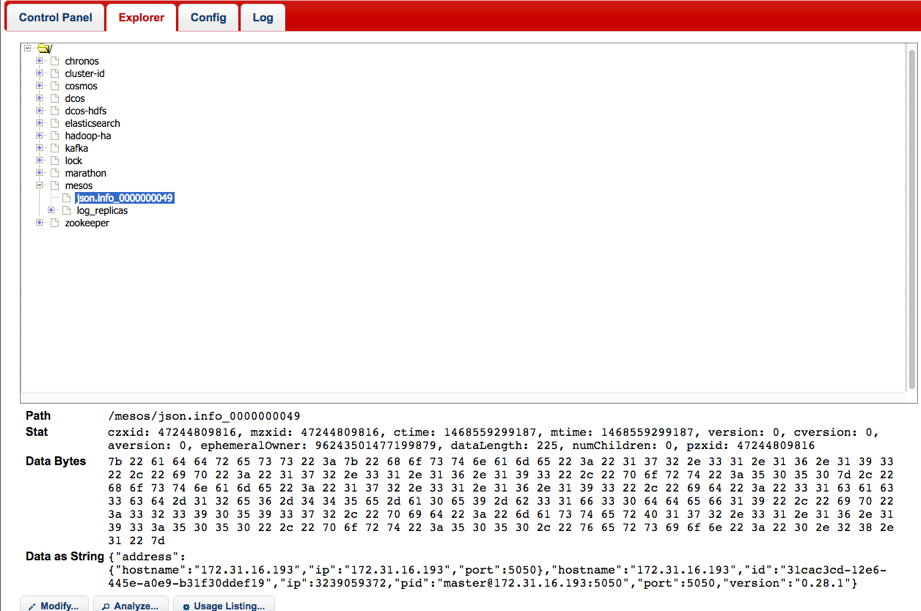

# 4.1 Mesos DC/OS

## 架构

## 组件
### Marathon

Marathon is a framework for Mesos that is designed to launch long-running applications, and, in Mesosphere, serves as a replacement for a traditional init system. It has many features that simplify running applications in a clustered environment, such as high-availability, node constraints, application health checks, an API for scriptability and service discovery, and an easy to use web user interface. It adds its scaling and self-healing capabilities to the Mesosphere feature set.
Marathon can be used to start other Mesos frameworks, and it can also launch any process that can be started in the regular shell. As it is designed for long-running applications, it will ensure that applications it has launched will continue running, even if the slave node(s) they are running on fails.

Marathon([项目链接](https://mesosphere.github.io/marathon/))是运行在Mesos之上的一个框架，在DC/OS中作为第一个框架被启动，用于启动其他长期运行的应用程序，其角色类似于Linux中的initd。

它有许多功能，简化了在集群环境中运行应用程序，如：

* 高可用性。High Availability. Marathon runs as an active/passive cluster with leader election for 100% uptime.
* 多种容器支持。Marathon能够支持的容器包括Mesos使用cgroups实现的native容器，和Docker。
* 节点约束。

高可用性，节点的限制，应用健康检查，为脚本化和服务发现的API，以及一个易于使用的Web用户界面。它增加了它的缩放和自我修复能力，到中间层的功能集。

Multiple container runtimes. Marathon has first-class support for both Mesos containers (using cgroups) and Docker.
Stateful apps. Marathon can bind persistent storage volumes to your application. You can run databases like MySQL and Postgres, and have storage accounted for by Mesos.
Beautiful and powerful UI.
Constraints. e.g. Only one instance of an application per rack, node, etc.
Service Discovery & Load Balancing. Several methods available.
Health Checks. Evaluate your application's health using HTTP or TCP checks.
Event Subscription. Supply an HTTP endpoint to receive notifications - for example to integrate with an external load balancer.
Metrics. Query them at /metrics in JSON format or push them to systems like graphite, statsd and Datadog.
Complete REST API for easy integration and scriptability.

马拉松可以用来启动其他Mesos框架，并且它也可以发射能在常规壳开始的任何方法。由于它是专为长时间运行的应用程序，这将确保它已经推出的应用程序将继续运行，即使它们运行的从节点（S）失败。

### DNS
Mesos-DNS([项目链接](https://mesosphere.github.com/mesos-dns))是用来在Apache Mesos集群内提供一套遵循[DNS](http://en.wikipedia.org/wiki/Domain_Name_System)风格的服务发现机制。

### Spartan
Spartan([项目链接](https://github.com/dcos/spartan))
### Chronos
### Exhibitor

Exhibitor([项目链接](https://github.com/dcos/exhibitor))是一个封装了ZooKeeper访问的协作服务，提供了一个可视化的Web操作页面，能用于实体监控、备份/恢复以及节点管理。

### Admin Router

### Minuteman:分布式负载均衡
### lashup:A distributed CRDT store with multicast and failure detector capabilities
### 包仓库Universe
### Cosmos
### Other

marathon
