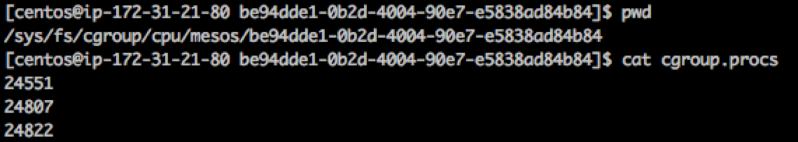

# Mesos的Hadoop支持

## Mesos-hadoop
github上有一个项目（[项目主页](https://github.com/mesos/hadoop))，用于在Mesos上运行Hadoop。其实现中的Hadoop整体打包进了CDH5.2发行版，只支持MapReduce 1.0版本，不支持MapReduce 2.0和YARN。项目现在活跃度很低，最后的更新已经是半年前，已经算是昨日黄花了。

## HDFS
现在Mesos DC/OS的仓库中提供了一个HDFS的包，其项目([项目主页](https://github.com/mesosphere/hdfs))实现源自Brenden Matthews，用于在DC/OS上一键启动一个“标准化”的HDFS服务，其中包括2个NameNode（和相应的DFSZKFailoverController服务），3个JournalNode其他的为DataNode，缺省实现为3个DataNode，如下图：


现在Mesos上开源的实现将所有的服务使用基于cgroups的容器封装，限制其CPU、内存和磁盘使用，比如NameNode的配额为使用0.5个CPU核，4.0GB内存以及最多10GB的磁盘空间：


登录相应的节点，可以看到HDFS框架启动的NameNode服务进程，本示例中进程号为24822，请注意Java Heap的值是2GB，而非上面看到的4GB：


另外还有一个相应的DFSZKFailoverController服务，进程，本示例中进程号为24807：


用CPU使用限制为例，下面是cgroup的CPU限制文件，进程号24822和24807已经在里面，可见NameNode进程和DFSZKFailoverController的CPU使用已经被限制，而其中还有一个24551是他们的父进程，即Executor进程。



所以这三个服务是共用了cgroup的配额，这也解释了为什么上面web上看到NameNode总分配的是4GB，而服务进程的Java Heap（-Xmx参数）只有2GB，因为总分配中还包括了Executor（本示例中实际配额为1GB）和DFSZKFailoverController（本示例中实际配额为约600MB）需要的内存，另外还于楼了一部分的native开销。
#### 配置文件
##### Executor 配置文件
```
core:
  default_name : ${HADOOP_DEFAULT_NAME:-'hdfs://hdfs'}
  hue_hosts : "${HADOOP_HUE_HOSTS:-*}"
  hue_groups : "${HADOOP_HUE_GROUPS:-*}"
  root_hosts : "${HADOOP_ROOT_HOSTS:-*}"
  root_groups : "${HADOOP_ROOT_GROUPS:-*}"
  http_fs_hosts : "${HADOOP_HTTP_FS_HOSTS:-*}"
  http_fs_groups : "${HADOOP_HTTP_FS_GROUPS:-*}"
hdfs:
  service_name : ${SERVICE_NAME:-'hdfs'}
  name_node_bind_host : ${HDFS_NAME_NODE_BIND_HOST:-'0.0.0.0'}
  name_node_rpc_port : ${HDFS_NAME_NODE_RPC_PORT:-50071}
  name_node_http_port : ${HDFS_NAME_NODE_HTTP_PORT:-50070}
  journal_nodes : ${HDFS_JOURNAL_NODES:-3}
  journal_node_address : ${HDFS_JOURNAL_NODE_ADDRESS:-'0.0.0.0'}
  journal_node_rpc_port : ${HDFS_JOURNAL_NODE_RPC_PORT:-8485}
  journal_node_http_port : ${HDFS_JOURNAL_NODE_HTTP_PORT:-8480}
  data_node_address : ${HDFS_DATA_NODE_ADDRESS:-'0.0.0.0'}
  data_node_rpc_port : ${HDFS_DATA_NODE_RPC_PORT:-50075}
  data_node_http_port : ${HDFS_DATA_NODE_HTTP_PORT:-50010}
  data_node_ipc_port : ${HDFS_DATA_NODE_IPC_PORT:-50020}
  volume_directory : ${HDFS_VOLUME_DIRECTORY:-'volume'}
  domain_socket_directory : ${HDFS_DOMAIN_SOCKET_DIRECTORY:-''}
  zookeeper_quorum : ${HDFS_ZOOKEEPER_QUORUM:-'master.mesos:2181'}
  permissions_enabled : ${HDFS_PERMISSIONS_ENABLED:-false}
  data_node_bandwidth_per_second : ${HDFS_DATA_NODE_BANDWIDTH_PER_SECOND:-41943040}
  name_node_threshold_percentage : ${HDFS_NAME_NODE_THRESHOLD_PERCENTAGE:-0.9}
  name_node_heartbeat_recheck_interval : ${HDFS_NAME_NODE_HEARTBEAT_RECHECK_INTERVAL:-60000}
  data_node_handler_count : ${HDFS_DATA_NODE_HANDLER_COUNT:-10}
  name_node_handler_count : ${HDFS_NAME_NODE_HANDLER_COUNT:-20}
  compress_image : ${HDFS_COMPRESS_IMAGE:-true}
  image_compression_codec : ${HDFS_IMAGE_COMPRESSION_CODEC:-'org.apache.hadoop.io.compress.SnappyCodec'}
  name_node_invalidate_work_percentage : ${HDFS_NAME_NODE_INVALIDATE_WORK_PERCENTAGE:-0.95}
  name_node_replication_work_multiplier : ${HDFS_NAME_NODE_REPLICATION_WORK_MULTIPLIER:-4}
  client_read_short_circuit : ${HDFS_CLIENT_READ_SHORT_CIRCUIT:-true}
  client_read_short_circuit_streams : ${HDFS_CLIENT_READ_SHORT_CIRCUIT_STREAMS:-1000}
  client_read_short_circuit_cache_expiry_ms : ${HDFS_CLIENT_READ_SHORT_CIRCUIT_CACHE_EXPIRY_MS:-1000}
hdfs_home : ${HDFS_HOME_DIR:-'./hapdoop-2.5.0-chd5.3.1'}
java_home : ${JAVA_HOME:-'./jre'}
```

##### DataNode环境变量参数
```
LIBPROCESS_IP=172.31.21.83
HADOOP_DATANODE_OPTS=-Dhadoop.security.logger=ERROR,RFAS 
MESOS_AGENT_ENDPOINT=172.31.21.83:5051
HADOOP_IDENT_STRING=
HDFS_DATA_NODE_BANDWIDTH_PER_SECOND=41943040
HDFS_JOURNAL_NODE_ADDRESS=0.0.0.0
SHELL=/usr/bin/bash
HADOOP_PID_DIR=
HADOOP_PREFIX=/var/lib/mesos/slave/slaves/31cac3cd-12e6-445e-a0e9-b31f30ddef19-S0/frameworks/052098b0-7b7c-4c7c-9d84-0911f251a41e-0001/executors/hdfs-executordatanode-0-ff57753e-5492-4725-82a1-1d0b36334c4b/runs/fcd9df3b-1550-464b-83d4-7094f44c2312/hadoop-2.6.0-cdh5.7.1
HDFS_COMPRESS_IMAGE=true
MESOS_DIRECTORY=/var/lib/mesos/slave/slaves/31cac3cd-12e6-445e-a0e9-b31f30ddef19-S0/frameworks/052098b0-7b7c-4c7c-9d84-0911f251a41e-0001/executors/hdfs-executordatanode-0-ff57753e-5492-4725-82a1-1d0b36334c4b/runs/fcd9df3b-1550-464b-83d4-7094f44c2312
HDFS_NAME_NODE_RPC_PORT=9001
HDFS_NAME_NODE_INVALIDATE_WORK_PERCENTAGE=0.95
HDFS_NAME_NODE_HANDLER_COUNT=20
JAVA_OPTS=-Xmx768M
LD_LIBRARY_PATH=/var/lib/mesos/slave/slaves/31cac3cd-12e6-445e-a0e9-b31f30ddef19-S0/frameworks/052098b0-7b7c-4c7c-9d84-0911f251a41e-0001/executors/hdfs-executordatanode-0-ff57753e-5492-4725-82a1-1d0b36334c4b/runs/fcd9df3b-1550-464b-83d4-7094f44c2312/./hadoop-2.6.0-cdh5.7.1/lib/native:/var/lib/mesos/slave/slaves/31cac3cd-12e6-445e-a0e9-b31f30ddef19-S0/frameworks/052098b0-7b7c-4c7c-9d84-0911f251a41e-0001/executors/hdfs-executordatanode-0-ff57753e-5492-4725-82a1-1d0b36334c4b/runs/fcd9df3b-1550-464b-83d4-7094f44c2312/hadoop-2.6.0-cdh5.7.1/lib/native
MESOS_EXECUTOR_ID=hdfs-executordatanode-0-ff57753e-5492-4725-82a1-1d0b36334c4b
HADOOP_HEAPSIZE=2048
HDFS_DATA_NODE_HTTP_PORT=9004
HDFS_CLIENT_READ_SHORT_CIRCUIT_STREAMS=1000
MALLOC_ARENA_MAX=4
HADOOP_HTTP_FS_GROUPS=*
HADOOP_SECURE_DN_PID_DIR=
HADOOP_HUE_HOSTS=*
HADOOP_SECURE_DN_LOG_DIR=/
HDFS_ZOOKEEPER_QUORUM=master.mesos:2181
HDFS_DATA_NODE_ADDRESS=0.0.0.0
HADOOP_HUE_GROUPS=*
NLSPATH=/usr/dt/lib/nls/msg/%L/%N.cat
PATH=/usr/bin:/bin
HADOOP_ROOT_HOSTS=*
HADOOP_HDFS_HOME=/var/lib/mesos/slave/slaves/31cac3cd-12e6-445e-a0e9-b31f30ddef19-S0/frameworks/052098b0-7b7c-4c7c-9d84-0911f251a41e-0001/executors/hdfs-executordatanode-0-ff57753e-5492-4725-82a1-1d0b36334c4b/runs/fcd9df3b-1550-464b-83d4-7094f44c2312/hadoop-2.6.0-cdh5.7.1
HDFS_NAME_NODE_THRESHOLD_PERCENTAGE=0.9
HDFS_NAME_NODE_HEARTBEAT_RECHECK_INTERVAL=60000
HDFS_CLIENT_READ_SHORT_CIRCUIT=true
HADOOP_CLIENT_OPTS=-Xmx512m 
HADOOP_COMMON_HOME=/var/lib/mesos/slave/slaves/31cac3cd-12e6-445e-a0e9-b31f30ddef19-S0/frameworks/052098b0-7b7c-4c7c-9d84-0911f251a41e-0001/executors/hdfs-executordatanode-0-ff57753e-5492-4725-82a1-1d0b36334c4b/runs/fcd9df3b-1550-464b-83d4-7094f44c2312/hadoop-2.6.0-cdh5.7.1
PWD=/var/lib/mesos/slave/slaves/31cac3cd-12e6-445e-a0e9-b31f30ddef19-S0/frameworks/052098b0-7b7c-4c7c-9d84-0911f251a41e-0001/executors/hdfs-executordatanode-0-ff57753e-5492-4725-82a1-1d0b36334c4b/runs/fcd9df3b-1550-464b-83d4-7094f44c2312
MESOS_EXECUTOR_SHUTDOWN_GRACE_PERIOD=5secs
MESOS_NATIVE_JAVA_LIBRARY=/opt/mesosphere/packages/mesos--0335ca0d3700ea88ad8b808f3b1b84d747ed07f0/lib/libmesos-0.28.1.so
JAVA_HOME=/var/lib/mesos/slave/slaves/31cac3cd-12e6-445e-a0e9-b31f30ddef19-S0/frameworks/052098b0-7b7c-4c7c-9d84-0911f251a41e-0001/executors/hdfs-executordatanode-0-ff57753e-5492-4725-82a1-1d0b36334c4b/runs/fcd9df3b-1550-464b-83d4-7094f44c2312/./jre1.8.0_91
HADOOP_CLASSPATH=/contrib/capacity-scheduler/*.jar
MESOS_NATIVE_LIBRARY=/opt/mesosphere/packages/mesos--0335ca0d3700ea88ad8b808f3b1b84d747ed07f0/lib/libmesos-0.28.1.so
HADOOP_CONF_DIR=/var/lib/mesos/slave/slaves/31cac3cd-12e6-445e-a0e9-b31f30ddef19-S0/frameworks/052098b0-7b7c-4c7c-9d84-0911f251a41e-0001/executors/hdfs-executordatanode-0-ff57753e-5492-4725-82a1-1d0b36334c4b/runs/fcd9df3b-1550-464b-83d4-7094f44c2312/hadoop-2.6.0-cdh5.7.1/etc/hadoop
HDFS_VERSION=2.5.0
SASL_PATH=/opt/mesosphere/lib/sasl2
SERVICE_NAME=hdfs
HDFS_PERMISSIONS_ENABLED=false
HDFS_JOURNAL_NODE_HTTP_PORT=8480
XFILESEARCHPATH=/usr/dt/app-defaults/%L/Dt
HDFS_NAME_NODE_BIND_HOST=0.0.0.0
HADOOP_PORTMAP_OPTS=-Xmx512m 
HADOOP_OPTS= -Djava.net.preferIPv4Stack=true -Dhadoop.log.dir=/var/lib/mesos/slave/slaves/31cac3cd-12e6-445e-a0e9-b31f30ddef19-S0/frameworks/052098b0-7b7c-4c7c-9d84-0911f251a41e-0001/executors/hdfs-executordatanode-0-ff57753e-5492-4725-82a1-1d0b36334c4b/runs/fcd9df3b-1550-464b-83d4-7094f44c2312/hadoop-2.6.0-cdh5.7.1/logs -Dhadoop.log.file=hadoop.log -Dhadoop.home.dir=/var/lib/mesos/slave/slaves/31cac3cd-12e6-445e-a0e9-b31f30ddef19-S0/frameworks/052098b0-7b7c-4c7c-9d84-0911f251a41e-0001/executors/hdfs-executordatanode-0-ff57753e-5492-4725-82a1-1d0b36334c4b/runs/fcd9df3b-1550-464b-83d4-7094f44c2312/hadoop-2.6.0-cdh5.7.1 -Dhadoop.id.str= -Dhadoop.root.logger=INFO,console -Djava.library.path=/var/lib/mesos/slave/slaves/31cac3cd-12e6-445e-a0e9-b31f30ddef19-S0/frameworks/052098b0-7b7c-4c7c-9d84-0911f251a41e-0001/executors/hdfs-executordatanode-0-ff57753e-5492-4725-82a1-1d0b36334c4b/runs/fcd9df3b-1550-464b-83d4-7094f44c2312/hadoop-2.6.0-cdh5.7.1/lib/native -Dhadoop.policy.file=hadoop-policy.xml -Djava.net.preferIPv4Stack=true -server -Dhadoop.security.logger=ERROR,RFAS  -Dhadoop.security.logger=INFO,NullAppender
HDFS_DOMAIN_SOCKET_DIRECTORY=
MESOS_SLAVE_PID=slave(1)@172.31.21.83:5051
HADOOP_ROOT_GROUPS=*
HADOOP_DEFAULT_NAME=hdfs://hdfs
HADOOP_SECONDARYNAMENODE_OPTS=-Dhadoop.security.logger=INFO,RFAS -Dhdfs.audit.logger=INFO,NullAppender 
MESOS_FRAMEWORK_ID=052098b0-7b7c-4c7c-9d84-0911f251a41e-0001
MESOS_CHECKPOINT=1
HDFS_CLIENT_READ_SHORT_CIRCUIT_CACHE_EXPIRY_MS=1000
SHLVL=1
HDFS_NAME_NODE_REPLICATION_WORK_MULTIPLIER=4
HDFS_DATA_NODE_IPC_PORT=9005
LIBPROCESS_PORT=0
HADOOP_SECURE_DN_USER=
HADOOP_NAMENODE_OPTS=-Dhadoop.security.logger=INFO,RFAS -Dhdfs.audit.logger=INFO,NullAppender 
HDFS_JOURNAL_NODE_RPC_PORT=8485
HDFS_DATA_NODE_RPC_PORT=9003
HADOOP_HTTP_FS_HOSTS=*
CLASSPATH=/var/lib/mesos/slave/slaves/31cac3cd-12e6-445e-a0e9-b31f30ddef19-S0/frameworks/052098b0-7b7c-4c7c-9d84-0911f251a41e-0001/executors/hdfs-executordatanode-0-ff57753e-5492-4725-82a1-1d0b36334c4b/runs/fcd9df3b-1550-464b-83d4-7094f44c2312/hadoop-2.6.0-cdh5.7.1/etc/hadoop:/var/lib/mesos/slave/slaves/31cac3cd-12e6-445e-a0e9-b31f30ddef19-S0/frameworks/052098b0-7b7c-4c7c-9d84-0911f251a41e-0001/executors/hdfs-executordatanode-0-ff57753e-5492-4725-82a1-1d0b36334c4b/runs/fcd9df3b-1550-464b-83d4-7094f44c2312/hadoop-2.6.0-cdh5.7.1/share/hadoop/common/lib/*:/var/lib/mesos/slave/slaves/31cac3cd-12e6-445e-a0e9-b31f30ddef19-S0/frameworks/052098b0-7b7c-4c7c-9d84-0911f251a41e-0001/executors/hdfs-executordatanode-0-ff57753e-5492-4725-82a1-1d0b36334c4b/runs/fcd9df3b-1550-464b-83d4-7094f44c2312/hadoop-2.6.0-cdh5.7.1/share/hadoop/common/*:/var/lib/mesos/slave/slaves/31cac3cd-12e6-445e-a0e9-b31f30ddef19-S0/frameworks/052098b0-7b7c-4c7c-9d84-0911f251a41e-0001/executors/hdfs-executordatanode-0-ff57753e-5492-4725-82a1-1d0b36334c4b/runs/fcd9df3b-1550-464b-83d4-7094f44c2312/hadoop-2.6.0-cdh5.7.1/share/hadoop/hdfs:/var/lib/mesos/slave/slaves/31cac3cd-12e6-445e-a0e9-b31f30ddef19-S0/frameworks/052098b0-7b7c-4c7c-9d84-0911f251a41e-0001/executors/hdfs-executordatanode-0-ff57753e-5492-4725-82a1-1d0b36334c4b/runs/fcd9df3b-1550-464b-83d4-7094f44c2312/hadoop-2.6.0-cdh5.7.1/share/hadoop/hdfs/lib/*:/var/lib/mesos/slave/slaves/31cac3cd-12e6-445e-a0e9-b31f30ddef19-S0/frameworks/052098b0-7b7c-4c7c-9d84-0911f251a41e-0001/executors/hdfs-executordatanode-0-ff57753e-5492-4725-82a1-1d0b36334c4b/runs/fcd9df3b-1550-464b-83d4-7094f44c2312/hadoop-2.6.0-cdh5.7.1/share/hadoop/hdfs/*:/share/hadoop/yarn/*:/share/hadoop/mapreduce/*:/contrib/capacity-scheduler/*.jar
HADOOP_NFS3_OPTS=
HDFS_HOME_DIR=./hadoop-2.6.0-cdh5.7.1
MESOS_SLAVE_ID=31cac3cd-12e6-445e-a0e9-b31f30ddef19-S0
HDFS_JOURNAL_NODES=3
HDFS_VOLUME_DIRECTORY=volume
HDFS_NAME_NODE_HTTP_PORT=9002
MESOS_SUBSCRIPTION_BACKOFF_MAX=2secs
MESOS_RECOVERY_TIMEOUT=15mins
HDFS_DATA_NODE_HANDLER_COUNT=10
MESOS_SANDBOX=/var/lib/mesos/slave/slaves/31cac3cd-12e6-445e-a0e9-b31f30ddef19-S0/frameworks/052098b0-7b7c-4c7c-9d84-0911f251a41e-0001/executors/hdfs-executordatanode-0-ff57753e-5492-4725-82a1-1d0b36334c4b/runs/fcd9df3b-1550-464b-83d4-7094f44c2312
HDFS_IMAGE_COMPRESSION_CODEC=org.apache.hadoop.io.compress.SnappyCodec
```


### YARN支持——Myraid
Apache的孵化器中有个一个叫Myraid的项目([项目主页]())，
### Spark
在整个Hadoop技术栈中，Spark的地位又比较特殊。它与Mesos同出生自Berkeley大学的AMP实验室，Matei Zaharia和Benjamin Hindman既是Spark项目也是Mesos项目的核心创始人，前者后来出去创办了DataBrick公司用于推广Spark技术，而后者作为创始人之一组建了Mesosphere公司，旨在提供基于Mesos技术的商业产品和服务。

Spark的第一个实现就是基于Mesos，后来才有YARN的实现。然而，2015年的[一项调查](http://cdn2.hubspot.net/hubfs/438089/DataBricks_Surveys_-_Content/Spark-Survey-2015-Infographic.pdf?t=1443116345933)显示实际运行在YARN上的Spark部署是Mesos的4倍。
