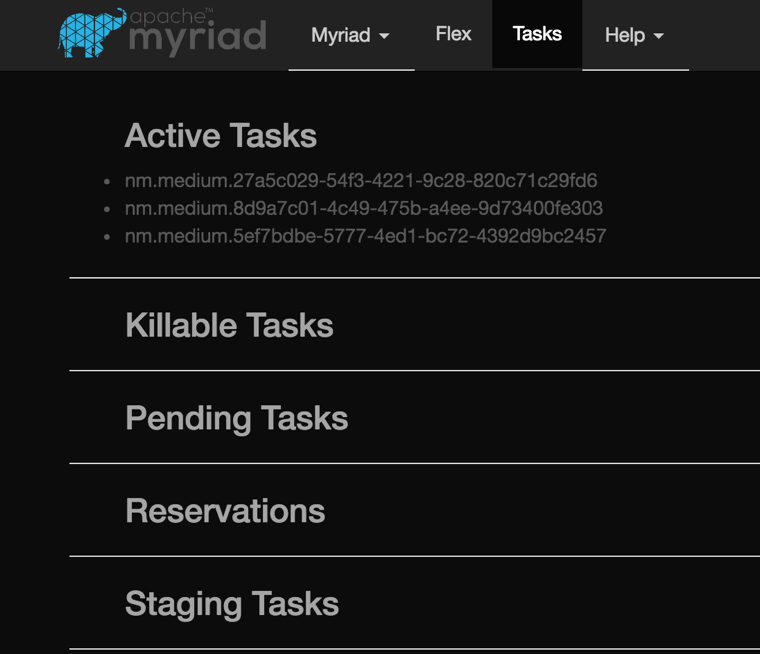

# Mesos的Hadoop支持

## Mesos-hadoop
github上有一个项目（[项目主页](https://github.com/mesos/hadoop))，用于在Mesos上运行Hadoop。其实现中的Hadoop整体打包进了CDH5.2发行版，只支持MapReduce 1.0版本，不支持MapReduce 2.0和YARN。项目现在活跃度很低，最后的更新已经是半年前，已经算是昨日黄花了。

## HDFS
现在Mesos DC/OS的仓库中提供了一个HDFS的包，其项目([项目主页](https://github.com/mesosphere/hdfs))实现源自Brenden Matthews，用于在DC/OS上一键启动一个“标准化”的HDFS服务，其中包括2个NameNode（和相应的DFSZKFailoverController服务），3个JournalNode，其他的为DataNode，缺省实现为3个DataNode，如下图：


现在Mesos上开源的实现将所有的服务使用基于cgroups的容器封装，限制其CPU、内存和磁盘使用，比如NameNode的配额为使用0.5个CPU核，4.0GB内存以及最多10GB的磁盘空间：


左边为Mesos Slave服务器要运行NameNode Executor总共分配的资源以及使用量，右边是NamNode任务实际需要的资源，可以看到少了一些资源，因为Executor自身也需要一定资源的，我们可以在Executor的运行日志中进行检验，可以stdout中有如下的输出：
```
06:01:13.658 [main] INFO  c.mesosphere.dcos.hdfs.executor.Main - Starting driver
06:01:13.721 [Thread-1] INFO  c.m.dcos.hdfs.executor.HdfsExecutor - Registered: executor = executor_id {
  value: "hdfs-executornamenode-0-455b848c-5df3-4848-8242-7e9b66673f5d"
}
resources {
  name: "cpus"
  type: SCALAR
  scalar {
    value: 0.5
  }
  role: "hdfs"
  reservation {
    principal: "hdfs"
    labels {
      labels {
        key: "resource_id"
        value: "8be33036-eddb-45e5-8629-980c88c285db"
      }
    }
  }
}
resources {
  name: "mem"
  type: SCALAR
  scalar {
    value: 1024.0
  }
  role: "hdfs"
  reservation {
    principal: "hdfs"
    labels {
      labels {
        key: "resource_id"
        value: "71025759-9f93-4fc5-a6f5-815713573b73"
      }
    }
  }
}
resources {
  name: "disk"
  type: SCALAR
  scalar {
    value: 1024.0
  }
  role: "hdfs"
  reservation {
    principal: "hdfs"
    labels {
      labels {
        key: "resource_id"
        value: "9ea6521f-6e9c-4bab-acf6-34a779d246fd"
      }
    }
  }
}
```

可以看到，Excutor自己用掉了0.5个CPU，1GB内存和1GB磁盘空间，这个和页面中观察到的一样。

登录相应的节点，可以看到HDFS框架启动的NameNode服务进程，本示例中进程号为24822，请注意Java Heap的值是2GB，而非上面看到的4GB：


另外还有一个相应的DFSZKFailoverController服务，进程，本示例中进程号为24807：


用CPU使用限制为例，下面是cgroup的CPU限制文件，进程号24822和24807已经在里面，而其中还有一个24551是他们的父进程，即Executor进程。可见NameNode进程和DFSZKFailoverController的CPU使用已经被限制，同时并没有建子cgroup进行更细的限制，与Executor共用5GB内存配额。


所以这三个服务是共用了cgroup的配额，这也解释了为什么上面web上看到NameNode总分配的是4GB，而服务进程的Java Heap（-Xmx参数）只有2GB，因为总分配中还包括了DFSZKFailoverController（本示例中实际配额为1GB）需要的内存，另外还预留了1GB的native开销。而Executor的stderr和stdout日志的LogRotate是放在Mesos Slave的cgroup下，被Mesos Slave分摊了。

链接NameNode的WebUI（本示例中Web服务端口不是缺省的50070，而是9002，参见后面的NameNode Task配置中的HDFS_NAME_NODE_HTTP_PORT），可以看到HDFS的总览：


以及所有DataNode的信息：


### Hadoop设置

HDFS中有很多配置，Mesosphere的HDFS项目是如何通过Mesos进行设置的呢？

如果是“人肉”手工在Mesos上安装mesos-hdfs，设置是通过修改mesos-site.xml文件，参见[这里](https://github.com/mesosphere/hdfs/blob/master/README.md)。如果是使用package命令通过univese repo来自动安装，需要修改服务器上的config.json文件。

按mesos官网的版本实现在[这里](https://github.com/mesosphere/universe/blob/version-3.x/repo/packages/H/hdfs/5/config.json)，举例。
"name_node_http_port": {
					"type": "integer",
					"id": "http://hdfs/dcos/mesosphere.com/hdfs/name_node_http_port",
					"description": "The HTTP port for HDFS Name Nodes. ",
					"default": 9002
				},

在实际部署中，marathon会将json中
这个实现是通过[org.apache.mesos.hdfs.config.HdfsFrameworkConfig](https://github.com/mesosphere/hdfs/blob/master/hdfs-commons/src/main/java/org/apache/mesos/hdfs/config/HdfsFrameworkConfig.java)类来实现，其读取设置的代码如下：
```java
  public HdfsFrameworkConfig() {
    // The path is configurable via the mesos.conf.path system property
    // so it can be changed when starting up the scheduler via bash
    Properties props = System.getProperties();
    Path configPath = new Path(props.getProperty("mesos.conf.path", "etc/hadoop/mesos-site.xml"));
    Configuration configuration = new Configuration();
    configuration.addResource(configPath);
    configuration.addResource(getSysPropertiesConfiguration());
    configuration.addResource(getEnvConfiguration());
    setConf(configuration);
  }
```

值得注意的是HDFS服务的设置是通过环境变量的方式设置的，而不是.xml文件。这对配置管理以及应用访问造成了极大的不便。


### 文件

https://github.com/mesosphere/universe/blob/version-3.x/repo/packages/H/hdfs/5/config.json

https://github.com/mesosphere/universe/blob/version-3.x/repo/packages/H/hdfs/5/marathon.json.mustache

https://downloads.mesosphere.com/hdfs/assets/0.9.0-2.6.0/scheduler.zip

https://downloads.mesosphere.com/hdfs/assets/0.9.0-2.6.0/hadoop-2.6.0-cdh5.7.1-dcos.tar.gz

https://downloads.mesosphere.com/hdfs/assets/0.9.0-2.6.0/executor.zip

### 配置文件

#### Config JSON配置
```
{
	"$schema": "http://json-schema.org/draft-04/schema#",
	"id": "http://hdfs/dcos/mesosphere.com",
	"type": "object",
	"properties": {
		"service": {
			"id": "http://hdfs/dcos/mesosphere.com/service",
			"type": "object",
			"description": "DC/OS service configuration properties",
			"properties": {
				"name": {
					"id": "http://hdfs/dcos/mesosphere.com/service/name",
					"type": "string",
					"description": "The name of the HDFS service instance.",
					"default": "hdfs"
				},
				"role": {
					"id": "http://hdfs/dcos/mesosphere.com/service/role",
					"type": "string",
					"description": "The role of the HDFS service instance.",
					"default": "hdfs-role"
				},
				"principal": {
					"id": "http://hdfs/dcos/mesosphere.com/service/principal",
					"type": "string",
					"description": "The principal for the HDFS service instance.",
					"default": "hdfs-principal"
				},
				"secret_name": {
					"type": "string",
					"description": "Name of the Secret Store credentials to use for DC/OS service authentication. This should be left empty unless service authentication is needed.",
					"default": ""
				},
				"cpus": {
					"id": "http://hdfs/dcos/mesosphere.com/service/cpus",
					"type": "number",
					"description": "The cpu shares used by the HDFS service scheduler.",
					"default": 0.5
				},
				"mem": {
					"id": "http://hdfs/dcos/mesosphere.com/service/mem",
					"type": "integer",
					"description": "The memory used by the HDFS service scheduler in Mb.",
					"default": 2048
				},
				"heap": {
					"id": "http://hdfs/dcos/mesosphere.com/service/heap",
					"type": "integer",
					"description": "The JVM heap used by the HDFS service scheduler in Mb.",
					"default": 1024
				},
				"api_port": {
					"id": "http://hdfs/dcos/mesosphere.com/service/api_port",
					"type": "integer",
					"description": "The port that the HDFS service API will accept on.",
					"default": 9000
				},
				"placement_strategy": {
					"id": "http://hdfs/dcos/mesosphere.com/service/placement_strategy",
					"type": "string",
					"description": "The placement strategy for HDFS nodes. This should always be NODE.",
					"default": "NODE"
				}
			},
			"additionalProperties": false,
			"required": [
				"name",
				"role",
				"principal",
				"cpus",
				"mem",
				"heap",
				"api_port",
				"placement_strategy"
			]
		},
		"name_node": {
			"id": "http://hdfs/dcos/mesosphere.com/name_node",
			"type": "object",
			"description": "HDFS Name Node configuration properties",
			"properties": {
				"cpus": {
					"id": "http://hdfs/dcos/mesosphere.com/name_node/cpus",
					"type": "number",
					"description": "The number of cpu shares allocated to the Name Node process.",
					"default": 0.5
				},
				"mem": {
					"id": "http://hdfs/dcos/mesosphere.com/name_node/mem",
					"type": "integer",
					"description": "The amount of memory, in MB, allocated to the Name Node process.",
					"default": 4096
				},
				"disk": {
					"id": "http://hdfs/dcos/mesosphere.com/name_node/disk",
					"type": "integer",
					"description": "The amount of disk, in MB, allocated to the Name Node process.",
					"default": 10240
				},
				"disk_type": {
					"id": "http://hdfs/dcos/mesosphere.com/name_node/diskType",
					"type": "string",
					"description": "Disk type to be used for storing Name Node data. See documentation. [ROOT, MOUNT]",
					"default": "ROOT"
				},
				"heap": {
					"id": "http://hdfs/dcos/mesosphere.com/name_node/heap",
					"type": "integer",
					"description": "The JVM heap used by the Name Node in Mb.",
					"default": 2048
				}
			},
			"additionalProperties": false,
			"required": [
				"cpus",
				"mem",
				"disk",
				"heap"
			]
		},
		"journal_node": {
			"id": "http://hdfs/dcos/mesosphere.com/journal_node",
			"type": "object",
			"description": "HDFS Journal Node configuration properties",
			"properties": {
				"cpus": {
					"id": "http://hdfs/dcos/mesosphere.com/journal_node/cpus",
					"type": "number",
					"description": "The number of cpu shares allocated to the Journal Node process.",
					"default": 0.5
				},
				"mem": {
					"id": "http://hdfs/dcos/mesosphere.com/journal_node/mem",
					"type": "integer",
					"description": "The amount of memory, in MB, allocated to the Journal Node process.",
					"default": 4096
				},
				"disk": {
					"id": "http://hdfs/dcos/mesosphere.com/journal_node/disk",
					"type": "integer",
					"description": "The amount of disk, in MB, allocated to the Journal Node process.",
					"default": 10240
				},
				"disk_type": {
					"id": "http://hdfs/dcos/mesosphere.com/journal_node/diskType",
					"type": "string",
					"description": "Disk type to be used for storing Journal Node data. See documentation. [ROOT, MOUNT]",
					"default": "ROOT"
				},
				"heap": {
					"id": "http://hdfs/dcos/mesosphere.com/journal_node/heap",
					"type": "integer",
					"description": "The JVM heap used by the Journal Node in Mb.",
					"default": 2048
				},
				"count": {
					"id": "http://hdfs/dcos/mesosphere.com/journal_node/count",
					"type": "integer",
					"description": "The number of Nodes in the Quorum Journal. This should be either 3 or 5.",
					"default": 3
				}
			},
			"additionalProperties": false,
			"required": [
				"cpus",
				"mem",
				"disk",
				"heap",
				"count"
			]
		},
		"data_node": {
			"id": "http://hdfs/dcos/mesosphere.com/data_node",
			"type": "object",
			"description": "HDFS Data Node configuration properties",
			"properties": {
				"cpus": {
					"id": "http://hdfs/dcos/mesosphere.com/data_node/cpus",
					"type": "number",
					"description": "The number of cpu shares allocated to the Data Node process.",
					"default": 0.5
				},
				"mem": {
					"id": "http://hdfs/dcos/mesosphere.com/data_node/mem",
					"type": "integer",
					"description": "The amount of memory, in MB, allocated to the Data Node process.",
					"default": 4096
				},
				"disk": {
					"id": "http://hdfs/dcos/mesosphere.com/data_node/disk",
					"type": "integer",
					"description": "The amount of disk, in MB, allocated to the Data Node process.",
					"default": 10240
				},
				"disk_type": {
					"id": "http://hdfs/dcos/mesosphere.com/data_node/diskType",
					"type": "string",
					"description": "Disk type to be used for storing Data Node data. See documentation. [ROOT, MOUNT]",
					"default": "ROOT"
				},
				"heap": {
					"id": "http://hdfs/dcos/mesosphere.com/data_node/heap",
					"type": "integer",
					"description": "The JVM heap used by the Data Node in Mb.",
					"default": 2048
				},
				"count": {
					"id": "http://hdfs/dcos/mesosphere.com/data_node/count",
					"type": "integer",
					"description": "The number of Data Nodes in the cluster",
					"default": 3
				}
			},
			"additionalProperties": false,
			"required": [
				"cpus",
				"mem",
				"disk",
				"heap",
				"count"
			]
		},
		"executor": {
			"id": "http://hdfs/dcos/mesosphere.com/executor",
			"type": "object",
			"description": "The HDFS service executor configuration object.",
			"properties": {
				"cpus": {
					"id": "http://hdfs/dcos/mesosphere.com/executor/cpus",
					"type": "number",
					"description": "The cpu shares used by the HDFS service executor.",
					"default": 0.5
				},
				"mem": {
					"id": "http://hdfs/dcos/mesosphere.com/executor/mem",
					"type": "integer",
					"description": "The memory used by the HDFS service executor in Mb.",
					"default": 1024
				},
				"heap": {
					"id": "http://hdfs/dcos/mesosphere.com/executor/heap",
					"type": "integer",
					"description": "The JVM heap used by the HDFS service executor in Mb.",
					"default": 768
				},
				"disk": {
					"id": "http://hdfs/dcos/mesosphere.com/executor/heap",
					"type": "integer",
					"description": "The amount of disk used by the HDFS service executor in Mb.",
					"default": 1024
				}
			},
			"additionalProperties": false,
			"required": [
				"cpus",
				"mem",
				"heap",
				"disk"
			]
		},
		"hdfs": {
			"type": "object",
			"id": "http://hdfs/dcos/mesosphere.com/hdfs",
			"description": "HDFS File System configuration options",
			"properties": {
				"name_node_rpc_port": {
					"type": "integer",
					"id": "http://hdfs/dcos/mesosphere.com/hdfs/name_node_rpc_port",
					"description": "The RPC port for HDFS Name Nodes.",
					"default": 9001
				},
				"name_node_http_port": {
					"type": "integer",
					"id": "http://hdfs/dcos/mesosphere.com/hdfs/name_node_http_port",
					"description": "The HTTP port for HDFS Name Nodes. ",
					"default": 9002
				},
				"journal_node_rpc_port": {
					"type": "integer",
					"id": "http://hdfs/dcos/mesosphere.com/hdfs/journal_node_rpc_port",
					"description": "The RPC port used by Journal Nodes.",
					"default": 8485
				},
				"journal_node_http_port": {
					"type": "integer",
					"id": "http://hdfs/dcos/mesosphere.com/hdfs/journal_node_http_port",
					"description": "The HTTP port used by Journal Nodes.",
					"default": 8480
				},
				"data_node_rpc_port": {
					"type": "integer",
					"id": "http://hdfs/dcos/mesosphere.com/hdfs/data_node_rpc_port",
					"description": "The RPC port used by Data Nodes.",
					"default": 9003
				},
				"data_node_http_port": {
					"type": "integer",
					"id": "http://hdfs/dcos/mesosphere.com/hdfs/data_node_http_port",
					"description": "The HTTP port used by Data Nodes.",
					"default": 9004
				},
				"data_node_ipc_port": {
					"type": "integer",
					"id": "http://hdfs/dcos/mesosphere.com/hdfs/data_node_ipc_port",
					"description": "The IPS port used by Data Nodes.",
					"default": 9005
				},
				"permissions_enabled": {
					"type": "boolean",
					"id": "http://hdfs/dcos/mesosphere.com/hdfs/permissions_enabled",
					"description": "If true, permissions checking is enabled",
					"default": false
				},
				"name_node_heartbeat_recheck_interval": {
					"type": "integer",
					"id": "http://hdfs/dcos/mesosphere.com/hdfs/name_node_heartbeat_recheck_interval",
					"description": "This time decides the interval to check for expired datanodes.",
					"default": 60000
				},
				"compress_image": {
					"type": "boolean",
					"id": "http://hdfs/dcos/mesosphere.com/hdfs/compress_image",
					"description": "If true, the File System image will be compressed.",
					"default": true
				},
				"image_compression_codec": {
					"type": "string",
					"id": "http://hdfs/dcos/mesosphere.com/hdfs/image_compression_codec",
					"description": "The image compression codec for the File System image.",
					"default": "org.apache.hadoop.io.compress.SnappyCodec"
				}
			},
			"required": [
				"name_node_rpc_port",
				"name_node_http_port",
				"journal_node_rpc_port",
				"journal_node_http_port",
				"data_node_rpc_port",
				"data_node_http_port",
				"data_node_ipc_port",
				"permissions_enabled",
				"name_node_heartbeat_recheck_interval",
				"compress_image",
				"image_compression_codec"
			]
		}
	},
	"additionalProperties": false,
	"required": [
		"service",
		"name_node",
		"journal_node",
		"data_node",
		"executor",
		"hdfs"
	]
}
```
#### Scheduler 配置文件
```
service:
  name : ${SERVICE_NAME:-'hdfs'}
  user : ${SERVICE_USER:-"root"}
  role : "${SERVICE_ROLE:-${SERVICE_NAME:-hdfs}-role}"
  principal : "${SERVICE_PRINCIPAL:-${SERVICE_NAME:-hdfs}-principal}"
  secret: ${FRAMEWORK_SECRET_FILE:-""}
  failover_timeout_s : ${FRAMEWORK_FAILOVER_TIMEOUT_S:-604800}
  checkpoint : ${FRAMEWORK_CHECKPOINT:-true}
core:
  default_name : ${HADOOP_DEFAULT_NAME:-'hdfs://hdfs'}
  hue_hosts : ${HADOOP_HUE_HOSTS:-'*'}
  hue_groups : ${HADOOP_HUE_GROUPS:-'*'}
  root_hosts : ${HADOOP_ROOT_HOSTS:-'*'}
  root_groups : ${HADOOP_ROOT_GROUPS:-'*'}
  http_fs_hosts : ${HADOOP_HTTP_FS_HOSTS:-'*'}
  http_fs_groups : ${HADOOP_HTTP_FS_GROUPS:-'*'}
hdfs:
  service_name : ${SERVICE_NAME:-'hdfs'}
  name_node_bind_host : ${HDFS_NAME_NODE_BIND_HOST:-'0.0.0.0'}
  name_node_rpc_port : ${HDFS_NAME_NODE_RPC_PORT:-50071}
  name_node_http_port : ${HDFS_NAME_NODE_HTTP_PORT:-50070}
  journal_nodes : ${HDFS_JOURNAL_NODES:-3}
  journal_node_address : ${HDFS_JOURNAL_NODE_ADDRESS:-'0.0.0.0'}
  journal_node_rpc_port : ${HDFS_JOURNAL_NODE_RPC_PORT:-8485}
  journal_node_http_port : ${HDFS_JOURNAL_NODE_HTTP_PORT:-8480}
  data_node_address : ${HDFS_DATA_NODE_ADDRESS:-'0.0.0.0'}
  data_node_rpc_port : ${HDFS_DATA_NODE_RPC_PORT:-50075}
  data_node_http_port : ${HDFS_DATA_NODE_HTTP_PORT:-50010}
  data_node_ipc_port : ${HDFS_DATA_NODE_IPC_PORT:-50020}
  volume_directory : ${HDFS_VOLUME_DIRECTORY:-'volume'}
  domain_socket_directory : ${HDFS_DOMAIN_SOCKET_DIRECTORY:-''}
  zookeeper_quorum : ${HDFS_ZOOKEEPER_QUORUM:-'master.mesos:2181'}
  permissions_enabled : ${HDFS_PERMISSIONS_ENABLED:-false}
  data_node_bandwidth_per_second : ${HDFS_DATA_NODE_BANDWIDTH_PER_SECOND:-41943040}
  name_node_threshold_percentage : ${HDFS_NAME_NODE_THRESHOLD_PERCENTAGE:-0.9}
  name_node_heartbeat_recheck_interval : ${HDFS_NAME_NODE_HEARTBEAT_RECHECK_INTERVAL:-60000}
  data_node_handler_count : ${HDFS_DATA_NODE_HANDLER_COUNT:-10}
  name_node_handler_count : ${HDFS_NAME_NODE_HANDLER_COUNT:-20}
  compress_image : ${HDFS_COMPRESS_IMAGE:-false}
  image_compression_codec : ${HDFS_IMAGE_COMPRESSION_CODEC:-'org.apache.hadoop.io.compress.SnappyCodec'}
  name_node_invalidate_work_percentage : ${HDFS_NAME_NODE_INVALIDATE_WORK_PERCENTAGE:-0.95}
  name_node_replication_work_multiplier : ${HDFS_NAME_NODE_REPLICATION_WORK_MULTIPLIER:-4}
  client_read_short_circuit : ${HDFS_CLIENT_READ_SHORT_CIRCUIT:-true}
  client_read_short_circuit_streams : ${HDFS_CLIENT_READ_SHORT_CIRCUIT_STREAMS:-1000}
  client_read_short_circuit_cache_expiry_ms : ${HDFS_CLIENT_READ_SHORT_CIRCUIT_CACHE_EXPIRY_MS:-1000}
data_nodes_count: ${HDFS_DATA_NODES:-3}
name_node:
  cpus : ${HDFS_NAME_NODE_CPUS:-0.5}
  memory_mb : ${HDFS_NAME_NODE_MEMORY_MB:-4096}
  heap_mb : ${HDFS_NAME_NODE_HEAP_MB:-2048}
  disk_mb : ${HDFS_NAME_NODE_DISK_MB:-10240}
  disk_type : ${HDFS_NAME_NODE_DISK_TYPE:-"ROOT"}
journal_node:
  cpus : ${HDFS_JOURNAL_NODE_CPUS:-0.5}
  memory_mb : ${HDFS_JOURNAL_NODE_MEMORY_MB:-2048}
  heap_mb : ${HDFS_JOURNAL_NODE_HEAP_MB:-1024}
  disk_mb : ${HDFS_JOURNAL_NODE_DISK_MB:-10240}
  disk_type : ${HDFS_JOURNAL_NODE_DISK_TYPE:-"ROOT"}
data_node:
  cpus : ${HDFS_DATA_NODE_CPUS:-0.5}
  memory_mb : ${HDFS_DATA_NODE_MEMORY_MB:-4096}
  heap_mb : ${HDFS_DATA_NODE_HEAP_MB:-2048}
  disk_mb : ${HDFS_DATA_NODE_DISK_MB:-10240}
  disk_type : ${HDFS_DATA_NODE_DISK_TYPE:-"ROOT"}
executor:
  command : ${EXECUTOR_COMMAND:-'./executor/bin/hdfs-executor executor/conf/executor.yml'}
  cpus : ${EXECUTOR_CPUS:-0.1}
  memory_mb : ${EXECUTOR_MEMORY_MB:-768}
  disk_mb : ${EXECUTOR_DISK_MB:-1024}
  heap_mb : ${EXECUTOR_HEAP_MB:-512}
  java_home : ${EXECUTOR_JAVA_HOME:-"./jre"}
  hdfs_home : ${EXECUTOR_HDFS_HOME:- './hapdoop-2.6.0-chd5.7.0'}
  hdfs_version: ${EXECUTOR_HDFS_VERSION:- '2.6.0'}
  jre_url : ${EXECUTOR_JRE_LOCATION:-'https://s3-us-west-2.amazonaws.com/hdfs-dev/jre/server-jre-8u74-linux-x64.tar.gz'}
  executor_url : ${EXECUTOR_LOCATION:-'https://s3-us-west-2.amazonaws.com/hdfs-dev/executor.zip'}
  hdfs_url : ${EXECUTOR_HDFS_LOCATION:-'https://s3-us-west-2.amazonaws.com/hdfs-dev/hapdoop-2.6.0-chd5.7.0.tar.gz'}
dcos:
  servers: ${DCOS_SERVERS:-"master.mesos:2181"}
  path: ${DCOS_PATH:-"/mesos"}
  timeout_ms: ${DCOS_TIMEOUT_MS:-10000}
zookeeper:
  servers: ${ZOOKEEPER_SERVERS:-"master.mesos:2181"}
  session_timeout_ms: 10000
  connection_timeout_ms: 10000
  operation_timeout_ms: 10000
  backoff_ms: 10000
server:
  type: simple
  adminContextPath: /admin
  applicationContextPath: /
  connector:
    type: http
    port: ${API_PORT:-8080}
logging:
  level: ${LOG_LEVEL:-INFO}
  appenders:
    - type: file
      currentLogFilename: ${LOG_FILE:-hdfs-service.log}
      threshold: ALL
      archive: true
      archivedFileCount: 5
      archivedLogFilenamePattern: ${LOG_FILE:-hdfs-service.log}.%d
      timeZone: UTC
    - type: console
      threshold: ALL
      timeZone: UTC
      target: stdout
```
#### Executor 配置文件
```
core:
  default_name : ${HADOOP_DEFAULT_NAME:-'hdfs://hdfs'}
  hue_hosts : "${HADOOP_HUE_HOSTS:-*}"
  hue_groups : "${HADOOP_HUE_GROUPS:-*}"
  root_hosts : "${HADOOP_ROOT_HOSTS:-*}"
  root_groups : "${HADOOP_ROOT_GROUPS:-*}"
  http_fs_hosts : "${HADOOP_HTTP_FS_HOSTS:-*}"
  http_fs_groups : "${HADOOP_HTTP_FS_GROUPS:-*}"
hdfs:
  service_name : ${SERVICE_NAME:-'hdfs'}
  name_node_bind_host : ${HDFS_NAME_NODE_BIND_HOST:-'0.0.0.0'}
  name_node_rpc_port : ${HDFS_NAME_NODE_RPC_PORT:-50071}
  name_node_http_port : ${HDFS_NAME_NODE_HTTP_PORT:-50070}
  journal_nodes : ${HDFS_JOURNAL_NODES:-3}
  journal_node_address : ${HDFS_JOURNAL_NODE_ADDRESS:-'0.0.0.0'}
  journal_node_rpc_port : ${HDFS_JOURNAL_NODE_RPC_PORT:-8485}
  journal_node_http_port : ${HDFS_JOURNAL_NODE_HTTP_PORT:-8480}
  data_node_address : ${HDFS_DATA_NODE_ADDRESS:-'0.0.0.0'}
  data_node_rpc_port : ${HDFS_DATA_NODE_RPC_PORT:-50075}
  data_node_http_port : ${HDFS_DATA_NODE_HTTP_PORT:-50010}
  data_node_ipc_port : ${HDFS_DATA_NODE_IPC_PORT:-50020}
  volume_directory : ${HDFS_VOLUME_DIRECTORY:-'volume'}
  domain_socket_directory : ${HDFS_DOMAIN_SOCKET_DIRECTORY:-''}
  zookeeper_quorum : ${HDFS_ZOOKEEPER_QUORUM:-'master.mesos:2181'}
  permissions_enabled : ${HDFS_PERMISSIONS_ENABLED:-false}
  data_node_bandwidth_per_second : ${HDFS_DATA_NODE_BANDWIDTH_PER_SECOND:-41943040}
  name_node_threshold_percentage : ${HDFS_NAME_NODE_THRESHOLD_PERCENTAGE:-0.9}
  name_node_heartbeat_recheck_interval : ${HDFS_NAME_NODE_HEARTBEAT_RECHECK_INTERVAL:-60000}
  data_node_handler_count : ${HDFS_DATA_NODE_HANDLER_COUNT:-10}
  name_node_handler_count : ${HDFS_NAME_NODE_HANDLER_COUNT:-20}
  compress_image : ${HDFS_COMPRESS_IMAGE:-true}
  image_compression_codec : ${HDFS_IMAGE_COMPRESSION_CODEC:-'org.apache.hadoop.io.compress.SnappyCodec'}
  name_node_invalidate_work_percentage : ${HDFS_NAME_NODE_INVALIDATE_WORK_PERCENTAGE:-0.95}
  name_node_replication_work_multiplier : ${HDFS_NAME_NODE_REPLICATION_WORK_MULTIPLIER:-4}
  client_read_short_circuit : ${HDFS_CLIENT_READ_SHORT_CIRCUIT:-true}
  client_read_short_circuit_streams : ${HDFS_CLIENT_READ_SHORT_CIRCUIT_STREAMS:-1000}
  client_read_short_circuit_cache_expiry_ms : ${HDFS_CLIENT_READ_SHORT_CIRCUIT_CACHE_EXPIRY_MS:-1000}
hdfs_home : ${HDFS_HOME_DIR:-'./hapdoop-2.5.0-chd5.3.1'}
java_home : ${JAVA_HOME:-'./jre'}
```
#### NameNode Task配置
```
{
NameNodeTask{info = name: "namenode-0"
task_id {
  value: "namenode-0__796de0f8-90fe-4149-8cd6-a2f7fed1b45e"
}
slave_id {
  value: "31cac3cd-12e6-445e-a0e9-b31f30ddef19-S2"
}
resources {
  name: "cpus"
  type: SCALAR
  scalar {
    value: 0.5
  }
  role: "hdfs"
  reservation {
    principal: "hdfs"
    labels {
      labels {
        key: "resource_id"
        value: "d9293230-c6df-4448-8acf-e9262a1b4de1"
      }
    }
  }
}
resources {
  name: "mem"
  type: SCALAR
  scalar {
    value: 4096.0
  }
  role: "hdfs"
  reservation {
    principal: "hdfs"
    labels {
      labels {
        key: "resource_id"
        value: "16a8a830-cbce-480c-bf95-f15a8ac53902"
      }
    }
  }
}
resources {
  name: "disk"
  type: SCALAR
  scalar {
    value: 10240.0
  }
  role: "hdfs"
  disk {
    persistence {
      id: "fdc70aba-7440-4756-b190-93191c56ed53"
      principal: "hdfs"
    }
    volume {
      container_path: "volume"
      mode: RW
    }
  }
  reservation {
    principal: "hdfs"
    labels {
      labels {
        key: "resource_id"
        value: "911c0c3f-58b3-4465-80a6-c28dac2c846f"
      }
    }
  }
}
resources {
  name: "ports"
  type: RANGES
  ranges {
    range {
      begin: 9001
      end: 9002
    }
  }
  role: "hdfs"
  reservation {
    principal: "hdfs"
    labels {
      labels {
        key: "resource_id"
        value: "83ae64b4-6d62-4a0e-a7df-005c3da336f2"
      }
    }
  }
}
executor {
  executor_id {
    value: "hdfs-executornamenode-0-455b848c-5df3-4848-8242-7e9b66673f5d"
  }
  resources {
    name: "cpus"
    type: SCALAR
    scalar {
      value: 0.5
    }
    role: "hdfs"
    reservation {
      principal: "hdfs"
      labels {
        labels {
          key: "resource_id"
          value: "8be33036-eddb-45e5-8629-980c88c285db"
        }
      }
    }
  }
  resources {
    name: "mem"
    type: SCALAR
    scalar {
      value: 1024.0
    }
    role: "hdfs"
    reservation {
      principal: "hdfs"
      labels {
        labels {
          key: "resource_id"
          value: "71025759-9f93-4fc5-a6f5-815713573b73"
        }
      }
    }
  }
  resources {
    name: "disk"
    type: SCALAR
    scalar {
      value: 1024.0
    }
    role: "hdfs"
    reservation {
      principal: "hdfs"
      labels {
        labels {
          key: "resource_id"
          value: "9ea6521f-6e9c-4bab-acf6-34a779d246fd"
        }
      }
    }
  }
  command {
    uris {
      value: "https://downloads.mesosphere.com/hdfs/assets/0.9.0-2.6.0/hadoop-2.6.0-cdh5.7.1-dcos.tar.gz"
      executable: false
      extract: true
      cache: false
    }
    uris {
      value: "https://downloads.mesosphere.com/hdfs/assets/0.9.0-2.6.0/executor.zip"
      executable: false
      extract: true
      cache: false
    }
    uris {
      value: "https://downloads.mesosphere.com/hdfs/assets/0.9.0-2.6.0/jre-8u91-linux-x64.tar.gz"
      executable: false
      extract: true
      cache: false
    }
    environment {
      variables {
        name: "HADOOP_DEFAULT_NAME"
        value: "hdfs://hdfs"
      }
      variables {
        name: "HADOOP_HUE_HOSTS"
        value: "*"
      }
      variables {
        name: "HADOOP_HUE_GROUPS"
        value: "*"
      }
      variables {
        name: "HADOOP_ROOT_HOSTS"
        value: "*"
      }
      variables {
        name: "HADOOP_ROOT_GROUPS"
        value: "*"
      }
      variables {
        name: "HADOOP_HTTP_FS_GROUPS"
        value: "*"
      }
      variables {
        name: "HADOOP_HTTP_FS_HOSTS"
        value: "*"
      }
      variables {
        name: "SERVICE_NAME"
        value: "hdfs"
      }
      variables {
        name: "HDFS_NAME_NODE_BIND_HOST"
        value: "0.0.0.0"
      }
      variables {
        name: "HDFS_NAME_NODE_RPC_PORT"
        value: "9001"
      }
      variables {
        name: "HDFS_NAME_NODE_HTTP_PORT"
        value: "9002"
      }
      variables {
        name: "HDFS_JOURNAL_NODES"
        value: "3"
      }
      variables {
        name: "HDFS_JOURNAL_NODE_ADDRESS"
        value: "0.0.0.0"
      }
      variables {
        name: "HDFS_JOURNAL_NODE_RPC_PORT"
        value: "8485"
      }
      variables {
        name: "HDFS_JOURNAL_NODE_HTTP_PORT"
        value: "8480"
      }
      variables {
        name: "HDFS_DATA_NODE_ADDRESS"
        value: "0.0.0.0"
      }
      variables {
        name: "HDFS_DATA_NODE_RPC_PORT"
        value: "9003"
      }
      variables {
        name: "HDFS_DATA_NODE_IPC_PORT"
        value: "9005"
      }
      variables {
        name: "HDFS_DATA_NODE_HTTP_PORT"
        value: "9004"
      }
      variables {
        name: "HDFS_VOLUME_DIRECTORY"
        value: "volume"
      }
      variables {
        name: "HDFS_DOMAIN_SOCKET_DIRECTORY"
        value: ""
      }
      variables {
        name: "HDFS_ZOOKEEPER_QUORUM"
        value: "master.mesos:2181"
      }
      variables {
        name: "HDFS_PERMISSIONS_ENABLED"
        value: "false"
      }
      variables {
        name: "HDFS_DATA_NODE_BANDWIDTH_PER_SECOND"
        value: "41943040"
      }
      variables {
        name: "HDFS_NAME_NODE_THRESHOLD_PERCENTAGE"
        value: "0.9"
      }
      variables {
        name: "HDFS_NAME_NODE_HEARTBEAT_RECHECK_INTERVAL"
        value: "60000"
      }
      variables {
        name: "HDFS_DATA_NODE_HANDLER_COUNT"
        value: "10"
      }
      variables {
        name: "HDFS_NAME_NODE_HANDLER_COUNT"
        value: "20"
      }
      variables {
        name: "HDFS_COMPRESS_IMAGE"
        value: "true"
      }
      variables {
        name: "HDFS_IMAGE_COMPRESSION_CODEC"
        value: "org.apache.hadoop.io.compress.SnappyCodec"
      }
      variables {
        name: "HDFS_NAME_NODE_INVALIDATE_WORK_PERCENTAGE"
        value: "0.95"
      }
      variables {
        name: "HDFS_NAME_NODE_REPLICATION_WORK_MULTIPLIER"
        value: "4"
      }
      variables {
        name: "HDFS_CLIENT_READ_SHORT_CIRCUIT"
        value: "true"
      }
      variables {
        name: "HDFS_CLIENT_READ_SHORT_CIRCUIT_STREAMS"
        value: "1000"
      }
      variables {
        name: "HDFS_CLIENT_READ_SHORT_CIRCUIT_CACHE_EXPIRY_MS"
        value: "1000"
      }
      variables {
        name: "JAVA_HOME"
        value: "./jre1.8.0_91"
      }
      variables {
        name: "JAVA_OPTS"
        value: "-Xmx768M"
      }
      variables {
        name: "HDFS_HOME_DIR"
        value: "./hadoop-2.6.0-cdh5.7.1"
      }
      variables {
        name: "HDFS_VERSION"
        value: "2.5.0"
      }
    }
    value: "./executor/bin/hdfs-executor executor/conf/executor.yml"
  }
  framework_id {
    value: "052098b0-7b7c-4c7c-9d84-0911f251a41e-0001"
  }
  name: "hdfs-executornamenode-0"
}
labels {
  labels {
    key: "hdfs_task_type"
    value: "NAME_NODE"
  }
  labels {
    key: "hdfs_heap_mb"
    value: "2048"
  }
  labels {
    key: "hdfs_upgrade"
    value: "false"
  }
  labels {
    key: "hdfs_task_ports"
    value: "9001,9002"
  }
  labels {
    key: "hdfs_rollback"
    value: "false"
  }
  labels {
    key: "hdfs_disk_type"
    value: "ROOT"
  }
  labels {
    key: "hdfs_task_hostname"
    value: "172.31.21.80"
  }
  labels {
    key: "hdfs_fs_formatted"
    value: "true"
  }
  labels {
    key: "hdfs_zkfc_formatted"
    value: "true"
  }
  labels {
    key: "hdfs_firstlaunch"
    value: "false"
  }
  labels {
    key: "hdfs_task_state"
    value: "TASK_LOST"
  }
  labels {
    key: "hdfs_node_initialized"
    value: "false"
  }
  labels {
    key: "hdfs_standby"
    value: "false"
  }
}
}
```

#### NameNode环境变量参数
```
LIBPROCESS_IP=172.31.21.80
MESOS_AGENT_ENDPOINT=172.31.21.80:5051
HDFS_DATA_NODE_BANDWIDTH_PER_SECOND=41943040
HDFS_JOURNAL_NODE_ADDRESS=0.0.0.0
SHELL=/usr/bin/bash
HDFS_COMPRESS_IMAGE=true
MESOS_DIRECTORY=/var/lib/mesos/slave/slaves/31cac3cd-12e6-445e-a0e9-b31f30ddef19-S2/frameworks/052098b0-7b7c-4c7c-9d84-0911f251a41e-0001/executors/hdfs-executornamenode-0-455b848c-5df3-4848-8242-7e9b66673f5d/runs/be94dde1-0b2d-4004-90e7-e5838ad84b84
OLDPWD=/var/lib/mesos/slave/slaves/31cac3cd-12e6-445e-a0e9-b31f30ddef19-S2/frameworks/052098b0-7b7c-4c7c-9d84-0911f251a41e-0001/executors/hdfs-executornamenode-0-455b848c-5df3-4848-8242-7e9b66673f5d/runs/be94dde1-0b2d-4004-90e7-e5838ad84b84/executor
HDFS_NAME_NODE_RPC_PORT=9001
HDFS_NAME_NODE_INVALIDATE_WORK_PERCENTAGE=0.95
HDFS_NAME_NODE_HANDLER_COUNT=20
JAVA_OPTS=-Xmx768M
LD_LIBRARY_PATH=/opt/mesosphere/lib
MESOS_EXECUTOR_ID=hdfs-executornamenode-0-455b848c-5df3-4848-8242-7e9b66673f5d
HDFS_DATA_NODE_HTTP_PORT=9004
HDFS_CLIENT_READ_SHORT_CIRCUIT_STREAMS=1000
HADOOP_HTTP_FS_GROUPS=*
HADOOP_HUE_HOSTS=*
HDFS_DATA_NODE_ADDRESS=0.0.0.0
HDFS_ZOOKEEPER_QUORUM=master.mesos:2181
HADOOP_HUE_GROUPS=*
PATH=/usr/bin:/bin
HADOOP_ROOT_HOSTS=*
HDFS_CLIENT_READ_SHORT_CIRCUIT=true
HDFS_NAME_NODE_HEARTBEAT_RECHECK_INTERVAL=60000
HDFS_NAME_NODE_THRESHOLD_PERCENTAGE=0.9
MESOS_EXECUTOR_SHUTDOWN_GRACE_PERIOD=5secs
PWD=/var/lib/mesos/slave/slaves/31cac3cd-12e6-445e-a0e9-b31f30ddef19-S2/frameworks/052098b0-7b7c-4c7c-9d84-0911f251a41e-0001/executors/hdfs-executornamenode-0-455b848c-5df3-4848-8242-7e9b66673f5d/runs/be94dde1-0b2d-4004-90e7-e5838ad84b84
JAVA_HOME=./jre1.8.0_91
MESOS_NATIVE_JAVA_LIBRARY=/opt/mesosphere/packages/mesos--0335ca0d3700ea88ad8b808f3b1b84d747ed07f0/lib/libmesos-0.28.1.so
MESOS_NATIVE_LIBRARY=/opt/mesosphere/packages/mesos--0335ca0d3700ea88ad8b808f3b1b84d747ed07f0/lib/libmesos-0.28.1.so
HDFS_VERSION=2.5.0
SASL_PATH=/opt/mesosphere/lib/sasl2
SERVICE_NAME=hdfs
HDFS_PERMISSIONS_ENABLED=false
HDFS_JOURNAL_NODE_HTTP_PORT=8480
HDFS_NAME_NODE_BIND_HOST=0.0.0.0
HDFS_DOMAIN_SOCKET_DIRECTORY=
HADOOP_DEFAULT_NAME=hdfs://hdfs
HADOOP_ROOT_GROUPS=*
MESOS_SLAVE_PID=slave(1)@172.31.21.80:5051
MESOS_FRAMEWORK_ID=052098b0-7b7c-4c7c-9d84-0911f251a41e-0001
MESOS_CHECKPOINT=1
HDFS_CLIENT_READ_SHORT_CIRCUIT_CACHE_EXPIRY_MS=1000
HDFS_NAME_NODE_REPLICATION_WORK_MULTIPLIER=4
SHLVL=1
HDFS_DATA_NODE_IPC_PORT=9005
LIBPROCESS_PORT=0
HDFS_JOURNAL_NODE_RPC_PORT=8485
HDFS_DATA_NODE_RPC_PORT=9003
HADOOP_HTTP_FS_HOSTS=*
HDFS_HOME_DIR=./hadoop-2.6.0-cdh5.7.1
MESOS_SLAVE_ID=31cac3cd-12e6-445e-a0e9-b31f30ddef19-S2
HDFS_JOURNAL_NODES=3
HDFS_VOLUME_DIRECTORY=volume
HDFS_NAME_NODE_HTTP_PORT=9002
MESOS_RECOVERY_TIMEOUT=15mins
MESOS_SUBSCRIPTION_BACKOFF_MAX=2secs
HDFS_DATA_NODE_HANDLER_COUNT=10
HDFS_IMAGE_COMPRESSION_CODEC=org.apache.hadoop.io.compress.SnappyCodec
MESOS_SANDBOX=/var/lib/mesos/slave/slaves/31cac3cd-12e6-445e-a0e9-b31f30ddef19-S2/frameworks/052098b0-7b7c-4c7c-9d84-0911f251a41e-0001/executors/hdfs-executornamenode-0-455b848c-5df3-4848-8242-7e9b66673f5d/runs/be94dde1-0b2d-4004-90e7-e5838ad84b84
```

#### DataNode环境变量参数
```
LIBPROCESS_IP=172.31.21.83
HADOOP_DATANODE_OPTS=-Dhadoop.security.logger=ERROR,RFAS 
MESOS_AGENT_ENDPOINT=172.31.21.83:5051
HADOOP_IDENT_STRING=
HDFS_DATA_NODE_BANDWIDTH_PER_SECOND=41943040
HDFS_JOURNAL_NODE_ADDRESS=0.0.0.0
SHELL=/usr/bin/bash
HADOOP_PID_DIR=
HADOOP_PREFIX=/var/lib/mesos/slave/slaves/31cac3cd-12e6-445e-a0e9-b31f30ddef19-S0/frameworks/052098b0-7b7c-4c7c-9d84-0911f251a41e-0001/executors/hdfs-executordatanode-0-ff57753e-5492-4725-82a1-1d0b36334c4b/runs/fcd9df3b-1550-464b-83d4-7094f44c2312/hadoop-2.6.0-cdh5.7.1
HDFS_COMPRESS_IMAGE=true
MESOS_DIRECTORY=/var/lib/mesos/slave/slaves/31cac3cd-12e6-445e-a0e9-b31f30ddef19-S0/frameworks/052098b0-7b7c-4c7c-9d84-0911f251a41e-0001/executors/hdfs-executordatanode-0-ff57753e-5492-4725-82a1-1d0b36334c4b/runs/fcd9df3b-1550-464b-83d4-7094f44c2312
HDFS_NAME_NODE_RPC_PORT=9001
HDFS_NAME_NODE_INVALIDATE_WORK_PERCENTAGE=0.95
HDFS_NAME_NODE_HANDLER_COUNT=20
JAVA_OPTS=-Xmx768M
LD_LIBRARY_PATH=/var/lib/mesos/slave/slaves/31cac3cd-12e6-445e-a0e9-b31f30ddef19-S0/frameworks/052098b0-7b7c-4c7c-9d84-0911f251a41e-0001/executors/hdfs-executordatanode-0-ff57753e-5492-4725-82a1-1d0b36334c4b/runs/fcd9df3b-1550-464b-83d4-7094f44c2312/./hadoop-2.6.0-cdh5.7.1/lib/native:/var/lib/mesos/slave/slaves/31cac3cd-12e6-445e-a0e9-b31f30ddef19-S0/frameworks/052098b0-7b7c-4c7c-9d84-0911f251a41e-0001/executors/hdfs-executordatanode-0-ff57753e-5492-4725-82a1-1d0b36334c4b/runs/fcd9df3b-1550-464b-83d4-7094f44c2312/hadoop-2.6.0-cdh5.7.1/lib/native
MESOS_EXECUTOR_ID=hdfs-executordatanode-0-ff57753e-5492-4725-82a1-1d0b36334c4b
HADOOP_HEAPSIZE=2048
HDFS_DATA_NODE_HTTP_PORT=9004
HDFS_CLIENT_READ_SHORT_CIRCUIT_STREAMS=1000
MALLOC_ARENA_MAX=4
HADOOP_HTTP_FS_GROUPS=*
HADOOP_SECURE_DN_PID_DIR=
HADOOP_HUE_HOSTS=*
HADOOP_SECURE_DN_LOG_DIR=/
HDFS_ZOOKEEPER_QUORUM=master.mesos:2181
HDFS_DATA_NODE_ADDRESS=0.0.0.0
HADOOP_HUE_GROUPS=*
NLSPATH=/usr/dt/lib/nls/msg/%L/%N.cat
PATH=/usr/bin:/bin
HADOOP_ROOT_HOSTS=*
HADOOP_HDFS_HOME=/var/lib/mesos/slave/slaves/31cac3cd-12e6-445e-a0e9-b31f30ddef19-S0/frameworks/052098b0-7b7c-4c7c-9d84-0911f251a41e-0001/executors/hdfs-executordatanode-0-ff57753e-5492-4725-82a1-1d0b36334c4b/runs/fcd9df3b-1550-464b-83d4-7094f44c2312/hadoop-2.6.0-cdh5.7.1
HDFS_NAME_NODE_THRESHOLD_PERCENTAGE=0.9
HDFS_NAME_NODE_HEARTBEAT_RECHECK_INTERVAL=60000
HDFS_CLIENT_READ_SHORT_CIRCUIT=true
HADOOP_CLIENT_OPTS=-Xmx512m 
HADOOP_COMMON_HOME=/var/lib/mesos/slave/slaves/31cac3cd-12e6-445e-a0e9-b31f30ddef19-S0/frameworks/052098b0-7b7c-4c7c-9d84-0911f251a41e-0001/executors/hdfs-executordatanode-0-ff57753e-5492-4725-82a1-1d0b36334c4b/runs/fcd9df3b-1550-464b-83d4-7094f44c2312/hadoop-2.6.0-cdh5.7.1
PWD=/var/lib/mesos/slave/slaves/31cac3cd-12e6-445e-a0e9-b31f30ddef19-S0/frameworks/052098b0-7b7c-4c7c-9d84-0911f251a41e-0001/executors/hdfs-executordatanode-0-ff57753e-5492-4725-82a1-1d0b36334c4b/runs/fcd9df3b-1550-464b-83d4-7094f44c2312
MESOS_EXECUTOR_SHUTDOWN_GRACE_PERIOD=5secs
MESOS_NATIVE_JAVA_LIBRARY=/opt/mesosphere/packages/mesos--0335ca0d3700ea88ad8b808f3b1b84d747ed07f0/lib/libmesos-0.28.1.so
JAVA_HOME=/var/lib/mesos/slave/slaves/31cac3cd-12e6-445e-a0e9-b31f30ddef19-S0/frameworks/052098b0-7b7c-4c7c-9d84-0911f251a41e-0001/executors/hdfs-executordatanode-0-ff57753e-5492-4725-82a1-1d0b36334c4b/runs/fcd9df3b-1550-464b-83d4-7094f44c2312/./jre1.8.0_91
HADOOP_CLASSPATH=/contrib/capacity-scheduler/*.jar
MESOS_NATIVE_LIBRARY=/opt/mesosphere/packages/mesos--0335ca0d3700ea88ad8b808f3b1b84d747ed07f0/lib/libmesos-0.28.1.so
HADOOP_CONF_DIR=/var/lib/mesos/slave/slaves/31cac3cd-12e6-445e-a0e9-b31f30ddef19-S0/frameworks/052098b0-7b7c-4c7c-9d84-0911f251a41e-0001/executors/hdfs-executordatanode-0-ff57753e-5492-4725-82a1-1d0b36334c4b/runs/fcd9df3b-1550-464b-83d4-7094f44c2312/hadoop-2.6.0-cdh5.7.1/etc/hadoop
HDFS_VERSION=2.5.0
SASL_PATH=/opt/mesosphere/lib/sasl2
SERVICE_NAME=hdfs
HDFS_PERMISSIONS_ENABLED=false
HDFS_JOURNAL_NODE_HTTP_PORT=8480
XFILESEARCHPATH=/usr/dt/app-defaults/%L/Dt
HDFS_NAME_NODE_BIND_HOST=0.0.0.0
HADOOP_PORTMAP_OPTS=-Xmx512m 
HADOOP_OPTS= -Djava.net.preferIPv4Stack=true -Dhadoop.log.dir=/var/lib/mesos/slave/slaves/31cac3cd-12e6-445e-a0e9-b31f30ddef19-S0/frameworks/052098b0-7b7c-4c7c-9d84-0911f251a41e-0001/executors/hdfs-executordatanode-0-ff57753e-5492-4725-82a1-1d0b36334c4b/runs/fcd9df3b-1550-464b-83d4-7094f44c2312/hadoop-2.6.0-cdh5.7.1/logs -Dhadoop.log.file=hadoop.log -Dhadoop.home.dir=/var/lib/mesos/slave/slaves/31cac3cd-12e6-445e-a0e9-b31f30ddef19-S0/frameworks/052098b0-7b7c-4c7c-9d84-0911f251a41e-0001/executors/hdfs-executordatanode-0-ff57753e-5492-4725-82a1-1d0b36334c4b/runs/fcd9df3b-1550-464b-83d4-7094f44c2312/hadoop-2.6.0-cdh5.7.1 -Dhadoop.id.str= -Dhadoop.root.logger=INFO,console -Djava.library.path=/var/lib/mesos/slave/slaves/31cac3cd-12e6-445e-a0e9-b31f30ddef19-S0/frameworks/052098b0-7b7c-4c7c-9d84-0911f251a41e-0001/executors/hdfs-executordatanode-0-ff57753e-5492-4725-82a1-1d0b36334c4b/runs/fcd9df3b-1550-464b-83d4-7094f44c2312/hadoop-2.6.0-cdh5.7.1/lib/native -Dhadoop.policy.file=hadoop-policy.xml -Djava.net.preferIPv4Stack=true -server -Dhadoop.security.logger=ERROR,RFAS  -Dhadoop.security.logger=INFO,NullAppender
HDFS_DOMAIN_SOCKET_DIRECTORY=
MESOS_SLAVE_PID=slave(1)@172.31.21.83:5051
HADOOP_ROOT_GROUPS=*
HADOOP_DEFAULT_NAME=hdfs://hdfs
HADOOP_SECONDARYNAMENODE_OPTS=-Dhadoop.security.logger=INFO,RFAS -Dhdfs.audit.logger=INFO,NullAppender 
MESOS_FRAMEWORK_ID=052098b0-7b7c-4c7c-9d84-0911f251a41e-0001
MESOS_CHECKPOINT=1
HDFS_CLIENT_READ_SHORT_CIRCUIT_CACHE_EXPIRY_MS=1000
SHLVL=1
HDFS_NAME_NODE_REPLICATION_WORK_MULTIPLIER=4
HDFS_DATA_NODE_IPC_PORT=9005
LIBPROCESS_PORT=0
HADOOP_SECURE_DN_USER=
HADOOP_NAMENODE_OPTS=-Dhadoop.security.logger=INFO,RFAS -Dhdfs.audit.logger=INFO,NullAppender 
HDFS_JOURNAL_NODE_RPC_PORT=8485
HDFS_DATA_NODE_RPC_PORT=9003
HADOOP_HTTP_FS_HOSTS=*
CLASSPATH=/var/lib/mesos/slave/slaves/31cac3cd-12e6-445e-a0e9-b31f30ddef19-S0/frameworks/052098b0-7b7c-4c7c-9d84-0911f251a41e-0001/executors/hdfs-executordatanode-0-ff57753e-5492-4725-82a1-1d0b36334c4b/runs/fcd9df3b-1550-464b-83d4-7094f44c2312/hadoop-2.6.0-cdh5.7.1/etc/hadoop:/var/lib/mesos/slave/slaves/31cac3cd-12e6-445e-a0e9-b31f30ddef19-S0/frameworks/052098b0-7b7c-4c7c-9d84-0911f251a41e-0001/executors/hdfs-executordatanode-0-ff57753e-5492-4725-82a1-1d0b36334c4b/runs/fcd9df3b-1550-464b-83d4-7094f44c2312/hadoop-2.6.0-cdh5.7.1/share/hadoop/common/lib/*:/var/lib/mesos/slave/slaves/31cac3cd-12e6-445e-a0e9-b31f30ddef19-S0/frameworks/052098b0-7b7c-4c7c-9d84-0911f251a41e-0001/executors/hdfs-executordatanode-0-ff57753e-5492-4725-82a1-1d0b36334c4b/runs/fcd9df3b-1550-464b-83d4-7094f44c2312/hadoop-2.6.0-cdh5.7.1/share/hadoop/common/*:/var/lib/mesos/slave/slaves/31cac3cd-12e6-445e-a0e9-b31f30ddef19-S0/frameworks/052098b0-7b7c-4c7c-9d84-0911f251a41e-0001/executors/hdfs-executordatanode-0-ff57753e-5492-4725-82a1-1d0b36334c4b/runs/fcd9df3b-1550-464b-83d4-7094f44c2312/hadoop-2.6.0-cdh5.7.1/share/hadoop/hdfs:/var/lib/mesos/slave/slaves/31cac3cd-12e6-445e-a0e9-b31f30ddef19-S0/frameworks/052098b0-7b7c-4c7c-9d84-0911f251a41e-0001/executors/hdfs-executordatanode-0-ff57753e-5492-4725-82a1-1d0b36334c4b/runs/fcd9df3b-1550-464b-83d4-7094f44c2312/hadoop-2.6.0-cdh5.7.1/share/hadoop/hdfs/lib/*:/var/lib/mesos/slave/slaves/31cac3cd-12e6-445e-a0e9-b31f30ddef19-S0/frameworks/052098b0-7b7c-4c7c-9d84-0911f251a41e-0001/executors/hdfs-executordatanode-0-ff57753e-5492-4725-82a1-1d0b36334c4b/runs/fcd9df3b-1550-464b-83d4-7094f44c2312/hadoop-2.6.0-cdh5.7.1/share/hadoop/hdfs/*:/share/hadoop/yarn/*:/share/hadoop/mapreduce/*:/contrib/capacity-scheduler/*.jar
HADOOP_NFS3_OPTS=
HDFS_HOME_DIR=./hadoop-2.6.0-cdh5.7.1
MESOS_SLAVE_ID=31cac3cd-12e6-445e-a0e9-b31f30ddef19-S0
HDFS_JOURNAL_NODES=3
HDFS_VOLUME_DIRECTORY=volume
HDFS_NAME_NODE_HTTP_PORT=9002
MESOS_SUBSCRIPTION_BACKOFF_MAX=2secs
MESOS_RECOVERY_TIMEOUT=15mins
HDFS_DATA_NODE_HANDLER_COUNT=10
MESOS_SANDBOX=/var/lib/mesos/slave/slaves/31cac3cd-12e6-445e-a0e9-b31f30ddef19-S0/frameworks/052098b0-7b7c-4c7c-9d84-0911f251a41e-0001/executors/hdfs-executordatanode-0-ff57753e-5492-4725-82a1-1d0b36334c4b/runs/fcd9df3b-1550-464b-83d4-7094f44c2312
HDFS_IMAGE_COMPRESSION_CODEC=org.apache.hadoop.io.compress.SnappyCodec
```


### YARN支持——Myraid
Apache的孵化器中有个一个叫Myraid的项目([项目主页](http://myriad.incubator.apache.org))，





#### 配置文件
##### Marathon JSON文件示例
```
{
  "mesosMaster": "master.mesos:5050",
  "checkpoint": false,
  "containerInfo": {
    "present": false
  },
  "frameworkFailoverTimeout": 60,
  "frameworkName": "MyriadAlpha",
  "frameworkRole": "myriad",
  "frameworkUser": "root",
  "frameworkSuperUser": "root",
  "profiles": {
    "zero": {
      "cpu": "0",
      "mem": "0"
    },
    "small": {
      "cpu": "2",
      "mem": "2048"
    },
    "medium": {
      "cpu": "6",
      "mem": "8192"
    },
    "large": {
      "cpu": "10",
      "mem": "12288"
    }
  },
  "nmInstances": {
    "medium": 0
  },
  "rebalancer": false,
  "nativeLibrary": "/usr/local/lib/libmesos.so",
  "zkServers": "master.mesos:2181",
  "zkTimeout": 20000,
  "restApiPort": 8192,
  "yarnEnvironment": {
    "YARN_HOME": "hadoop",
    "JAVA_HOME": "/opt/jre",
    "HADOOP_CONF_DIR": "hadoop/etc/hadoop",
    "MESOS_NATIVE_LIBRARY": "/usr/local/lib/libmesos.so",
    "MESOS_NATIVE_JAVA_LIBRARY": "/usr/local/lib/libmesos.so"
  },
  "mesosAuthenticationPrincipal": "myriad",
  "mesosAuthenticationSecretFilename": "",
  "servedConfigPath": {
    "present": false
  },
  "servedBinaryPath": {
    "present": false
  },
  "cgroupPath": "/sys/fs/cgroup",
  "haenabled": false,
  "serviceConfigurations": null,
  "nodeManagerConfiguration": {
    "jvmMaxMemoryMB": 2048,
    "cpus": 0.2,
    "jvmOpts": "value is absent",
    "cgroups": false
  },
  "myriadExecutorConfiguration": {
    "jvmMaxMemoryMB": 1024,
    "path": null,
    "nodeManagerUri": "http://10.1.131.41/myriad2/hadoop-2.7.2.tar.gz",
    "configUri": "value is absent",
    "jvmUri": "value is absent"
  }
}
```

##### Rest API

```
{
 "application": {
  "$": {
   "xmlns": "http://wadl.dev.java.net/2009/02"
  },
  "doc": [
   {
    "$": {
     "xmlns:jersey": "http://jersey.java.net/",
     "jersey:generatedBy": "Jersey: 1.9 09/02/2011 11:17 AM"
    }
   }
  ],
  "grammars": [
   ""
  ],
  "resources": [
   {
    "$": {
     "base": "http://10.1.131.44:8192/api/"
    },
    "resource": [
     {
      "$": {
       "path": "/resource"
      },
      "resource": [
       {
        "$": {
         "path": "/unreserve"
        },
        "method": [
         {
          "$": {
           "id": "unreserve",
           "name": "PUT"
          },
          "request": [
           {
            "representation": [
             {
              "$": {
               "mediaType": "application/json"
              }
             }
            ]
           }
          ],
          "response": [
           {
            "representation": [
             {
              "$": {
               "mediaType": "text/plain"
              }
             }
            ]
           }
          ]
         }
        ]
       },
       {
        "$": {
         "path": "/reserve"
        },
        "method": [
         {
          "$": {
           "id": "reserve",
           "name": "PUT"
          },
          "request": [
           {
            "representation": [
             {
              "$": {
               "mediaType": "application/json"
              }
             }
            ]
           }
          ],
          "response": [
           {
            "representation": [
             {
              "$": {
               "mediaType": "text/plain"
              }
             }
            ]
           }
          ]
         }
        ]
       }
      ]
     },
     {
      "$": {
       "path": "/state"
      },
      "method": [
       {
        "$": {
         "id": "getState",
         "name": "GET"
        },
        "response": [
         {
          "representation": [
           {
            "$": {
             "mediaType": "application/json"
            }
           }
          ]
         }
        ]
       }
      ]
     },
     {
      "$": {
       "path": "/cluster"
      },
      "resource": [
       {
        "$": {
         "path": "/flexup"
        },
        "method": [
         {
          "$": {
           "id": "flexUp",
           "name": "PUT"
          },
          "request": [
           {
            "representation": [
             {
              "$": {
               "mediaType": "application/json"
              }
             }
            ]
           }
          ],
          "response": [
           {
            "representation": [
             {
              "$": {
               "mediaType": "text/plain"
              }
             }
            ]
           }
          ]
         }
        ]
       },
       {
        "$": {
         "path": "/flexupservice"
        },
        "method": [
         {
          "$": {
           "id": "flexUpservice",
           "name": "PUT"
          },
          "request": [
           {
            "representation": [
             {
              "$": {
               "mediaType": "application/json"
              }
             }
            ]
           }
          ],
          "response": [
           {
            "representation": [
             {
              "$": {
               "mediaType": "text/plain"
              }
             }
            ]
           }
          ]
         }
        ]
       },
       {
        "$": {
         "path": "/flexdown"
        },
        "method": [
         {
          "$": {
           "id": "flexDown",
           "name": "PUT"
          },
          "request": [
           {
            "representation": [
             {
              "$": {
               "mediaType": "application/json"
              }
             }
            ]
           }
          ],
          "response": [
           {
            "representation": [
             {
              "$": {
               "mediaType": "text/plain"
              }
             }
            ]
           }
          ]
         }
        ]
       },
       {
        "$": {
         "path": "/flexdownservice"
        },
        "method": [
         {
          "$": {
           "id": "flexDownservice",
           "name": "PUT"
          },
          "request": [
           {
            "representation": [
             {
              "$": {
               "mediaType": "application/json"
              }
             }
            ]
           }
          ],
          "response": [
           {
            "representation": [
             {
              "$": {
               "mediaType": "text/plain"
              }
             }
            ]
           }
          ]
         }
        ]
       }
      ]
     },
     {
      "$": {
       "path": "/artifacts"
      },
      "resource": [
       {
        "$": {
         "path": "/config.tgz"
        },
        "method": [
         {
          "$": {
           "id": "getConfig",
           "name": "GET"
          },
          "response": [
           {
            "representation": [
             {
              "$": {
               "mediaType": "application/octet-stream"
              }
             }
            ]
           }
          ]
         }
        ]
       },
       {
        "$": {
         "path": "/binary.tgz"
        },
        "method": [
         {
          "$": {
           "id": "getBinary",
           "name": "GET"
          },
          "response": [
           {
            "representation": [
             {
              "$": {
               "mediaType": "application/octet-stream"
              }
             }
            ]
           }
          ]
         }
        ]
       }
      ]
     },
     {
      "$": {
       "path": "/framework"
      },
      "resource": [
       {
        "$": {
         "path": "/shutdown/framework"
        },
        "method": [
         {
          "$": {
           "id": "shutdownFramework",
           "name": "POST"
          },
          "response": [
           {
            "representation": [
             {
              "$": {
               "mediaType": "application/json"
              }
             }
            ]
           }
          ]
         }
        ]
       }
      ]
     },
     {
      "$": {
       "path": "/config"
      },
      "method": [
       {
        "$": {
         "id": "getConfig",
         "name": "GET"
        },
        "response": [
         {
          "representation": [
           {
            "$": {
             "mediaType": "application/json"
            }
           }
          ]
         }
        ]
       }
      ]
     }
    ]
   }
  ]
 }
```
### Spark
在整个Hadoop技术栈中，Spark的地位又比较特殊。它与Mesos同出生自Berkeley大学的AMP实验室，Matei Zaharia和Benjamin Hindman既是Spark项目也是Mesos项目的核心创始人，前者后来出去创办了DataBrick公司用于推广Spark技术，而后者作为创始人之一组建了Mesosphere公司，旨在提供基于Mesos技术的商业产品和服务。

Spark的第一个实现就是基于Mesos，后来才有YARN的实现。然而，2015年的[一项调查](http://cdn2.hubspot.net/hubfs/438089/DataBricks_Surveys_-_Content/Spark-Survey-2015-Infographic.pdf?t=1443116345933)显示实际运行在YARN上的Spark部署是Mesos的4倍。
