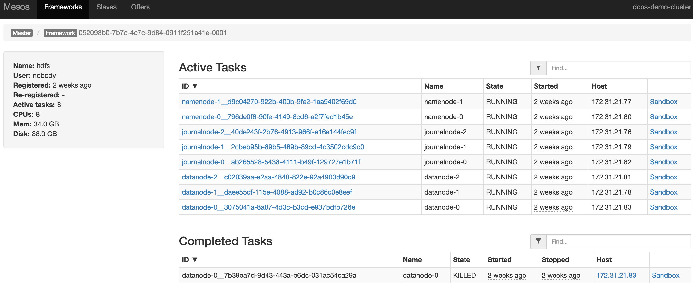
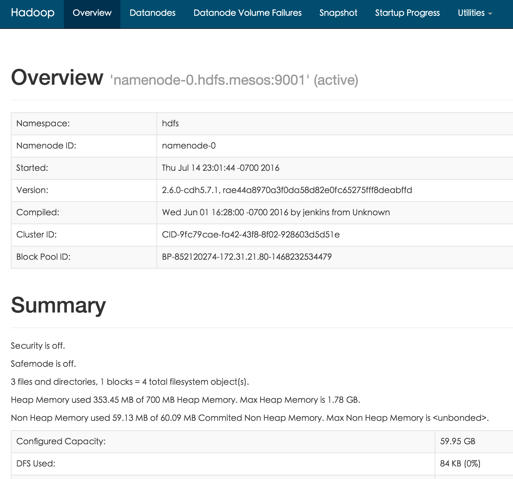
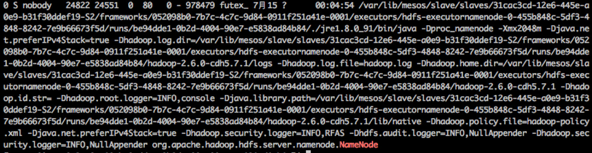
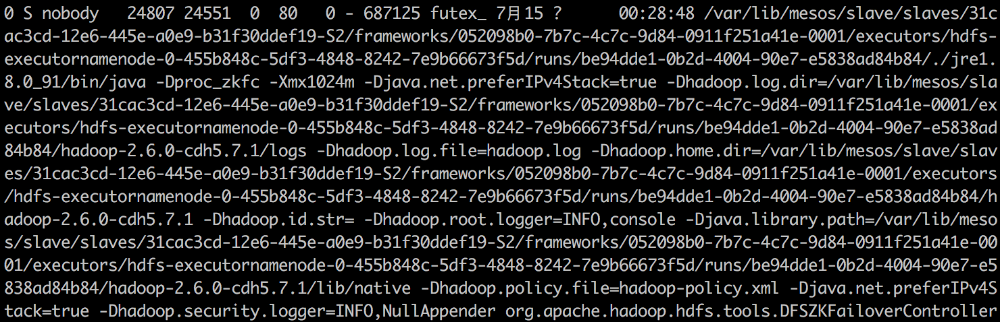

# Mesos与Yarn的对比

## 总体对比

然而在长远来说都不是，并且我相信在通用的技术支持上，如网络和IO资源管理、容器支持、服务管理等功能上没有太大区别。

YARN的调度是一层资源管理，而Mesos的调度是二层资源管理，因此理论上YARN能提供全局最优的资源分配策略，资源利用率比Mesos高；而Mesos能比YARN的资源分配策略更加灵活。
YARN的调度是以数据为中心，而Mesos的调度是以资源为中心
就实现来讲，YARN对于Hadoop上的框架支持很好，但对于其他计算框架支持很少；而Mesos作为通用的框架，能灵活的支持第三方的各种框架。
## 具体
| 0:0 | 1:0 | 2:0 | 3:0 |
| -- | -- | -- | -- |
| 0:2 | 1:2 | 2:2 | 3:2 |

## Mesos的Hadoop支持

### Mesos-hadoop
github上有一个项目（[项目主页](https://github.com/mesos/hadoop))，用于在Mesos上运行Hadoop。其实现中的Hadoop整体打包进了CDH5.2发行版，只支持MapReduce 1.0版本，不支持MapReduce 2.0和YARN。项目现在活跃度很低，最后的更新已经是半年前，已经算是昨日黄花了。

### HDFS
现在Mesos DC/OS的仓库中提供了一个HDFS的包，其项目([项目主页](https://github.com/mesosphere/hdfs))实现源自Brenden Matthews，用于在DC/OS上一键启动一个“标准化”的HDFS服务，其中包括2个NameNode（和相应的DFSZKFailoverController服务），3个JournalNode其他的为DataNode，缺省实现为3个DataNode，如下图：

现在Mesos上开源的实现将所有的服务使用基于cgroups的容器封装，限制其CPU、内存和磁盘使用，比如NameNode的配额为使用0.5个CPU核，4.0GB内存以及最多10GB的磁盘空间：

登录相应的节点，可以看到HDFS框架启动的NameNode服务进程，本示例中进程号为24822，请注意Java Heap的值是2GB，而非上面看到的4GB：

另外还有一个相应的DFSZKFailoverController服务，进程，本示例中进程号为24807：

用CPU使用限制为例，下面是cgroup的CPU限制文件，注意24822进程和24807后已经被限制，而其中还有一个24551是NameNode进程和DFSZKFailoverController的父进程，即Executor进程。

所以这三个服务是共用了cgroup的配额，这也解释了为什么上面web上看到NameNode总分配的是4GB，而服务进程的Java Heap（-Xmx参数）只有2GB，因为总分配中还包括了Executor（本示例中实际配额为1GB）和DFSZKFailoverController（本示例中实际配额为约600MB）需要的内存，另外还于楼了一部分的native开销。
### YARN支持——Myraid
Apache的孵化器中有个一个叫Myraid的项目([项目主页]())，
### Spark
在整个Hadoop技术栈中，Spark的地位又比较特殊。它与Mesos同出生自Berkeley大学的AMP实验室，Matei Zaharia和Benjamin Hindman既是Spark项目也是Mesos项目的核心创始人，前者后来出去创办了DataBrick公司用于推广Spark技术，而后者作为创始人之一组建了Mesosphere公司，旨在提供基于Mesos技术的商业产品和服务。

Spark的第一个实现就是基于Mesos，后来才有YARN的实现。然而，2015年的[一项调查](http://cdn2.hubspot.net/hubfs/438089/DataBricks_Surveys_-_Content/Spark-Survey-2015-Infographic.pdf?t=1443116345933)显示实际运行在YARN上的Spark部署是Mesos的4倍。

## 未来的可能
### Mesos and YARN
### Mesos over YARN

现在还有很多技术上的

与无状态服务不同，Hadoop上应用很多是以数据为中心，不仅对于数据的访问效率有要求，而且有些还是有状态的。
数据位置
部署代价：
### YARN over Mesos
